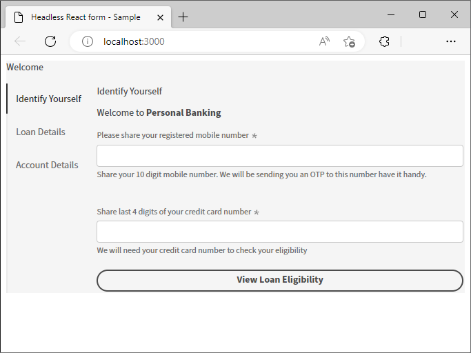

# React アプリを使用したヘッドレスフォームの作成とプレビュー {#introduction}

<!-- Missing image ALT image tags -->

スターターキットは、React アプリの使用をすぐに開始するのに役立ちます。Angular、Vanilla JS、およびその他の任意の開発環境で、ヘッドレスアダプティブフォームを自由に開発および使用できます。

ヘッドレスアダプティブフォームの概要は非常に簡単かつ迅速です。 既製の React プロジェクトのクローンを作成し、依存関係をインストールして、プロジェクトを実行します。 ヘッドレスアダプティブフォームを React アプリに統合して起動および実行している。 サンプル React プロジェクトを使用すると、実稼動環境にデプロイする前に、ヘッドレスアダプティブフォームを作成およびテストできます。

では、開始しましょう。

>[!NOTE]
>
>
> この入門ガイドでは、React アプリを使用しています。ヘッドレスアダプティブフォームを使用する際は、選択したテクノロジーやプログラミング言語を自由に使用できます。

## 事前準備 {#pre-requisites}

React アプリを作成して実行するには、コンピューターに次のものがインストールされている必要があります。

* [Git の最新リリース](https://git-scm.com/downloads)をインストールします。Git を初めて使用する場合は、[Git のインストール](https://git-scm.com/book/en/v2/Getting-Started-Installing-Git)を参照してください。

* [Node.js 16.13.0 以降 ](https://nodejs.org/ja/download/) をインストールします。<!-- URL is 404!! If you are new to Node.js, see [How to install Node.js](https://nodejs.dev/en/learn/how-to-install-nodejs). -->

## はじめに

要件を満たしたら、次の手順を実行して作業を開始します。

1. [ヘッドレスなアダプティブフォームのスターターキットを設定](#setup)

1. [スターターキットに含まれているヘッドレスアダプティブフォームをプレビューします](#preview)

1. [独自のヘッドレスアダプティブフォームの作成とレンダリング](#custom)


## &#x200B;1. ヘッドレスなアダプティブフォームのスターターキットをセットアップする {#install}

スターターキットは、サンプルのヘッドレスアダプティブフォームと対応するライブラリを備えた React アプリです。 キットを使用して、ヘッドレスアダプティブフォームと対応する React コンポーネントを開発およびテストします。 次のコマンドを実行して、ヘッドレスなアダプティブフォームのスターターキットを設定します。

1. コマンドプロンプトを開き、次のコマンドを実行します。

   ```shell
   git clone https://github.com/adobe/react-starter-kit-aem-headless-forms
   ```

   このコマンドは、現在の場所に **react-starter-kit-aem-headless-forms** というディレクトリを作成し、ヘッドレスアダプティブフォームの React スターターアプリをそのディレクトリに複製します。 ディレクトリには、フォームのレンダリングに必要な設定と依存関係のリストのほかに、次の重要なコンテンツが含まれます。

   * **サンプルフォーム**：スターターキットには、サンプルのローン申し込みフォームが含まれています。アプリに付属しているフォーム（フォーム定義）を表示するには、`/react-starter-kit-aem-headless-forms/form-definations/form-model.json` ファイルを開きます。
   * **サンプル React コンポーネント**：スターターキットには、リッチテキストとスライダーのサンプル React コンポーネントが含まれています。 このガイドは、これらのリッチテキストコンポーネントとスライダーコンポーネントを使用して独自のカスタムコンポーネントを作成するのに役立ちます。
   * **mappings.ts**：mappings.ts ファイルは、カスタムコンポーネントをフォームフィールドにマッピングするのに役立ちます。例えば、数値ステッパーフィールドを評価コンポーネントにマッピングします。
   * **環境設定**：環境設定では、スターターキットに含まれているフォームをレンダリングするか、AEM Forms サーバーからフォームを取得するかを選択できます。

   

   >[!NOTE]
   >
   > 
   > ドキュメント内の例は VSCode に基づいています。任意のプレーンテキストコードエディターを自由に使用できます。


1. **react-starter-kit-aem-headless-forms** ディレクトリに移動し、次のコマンドを実行して依存関係をインストールします。

   ```shell
   npm install
   ```

   このコマンドは、ヘッドレスアダプティブフォームライブラリ（@aemforms/af-react-renderer、@aemforms/af-react-components、@adobe/react-spectrum）を含む、アプリの構築と実行に必要なすべてのパッケージとライブラリをダウンロードします。 その後、検証を実行し、フォームインスタンスごとにデータを保持します。


   


## &#x200B;2. ヘッドレスアダプティブフォームをプレビューする {#preview}

スターターキットを設定すると、サンプルのヘッドレスアダプティブフォームをプレビューして、独自のカスタムフォームに置き換えることができます。 また、AEM Forms サーバーからフォームを取得するように、スターターキットを設定することもできます。フォームをプレビューするには、次の手順に従います。

1. `env_template` ファイルの名前を `.env` に変更します。また、USE_LOCAL_JSON オプションが true に設定されていることを確認します。

   

   <!-- The options in the .env file help you configure source of the forms definantion (.JSON):
    *  To source forms definantion (.JSON) from an AEM Server, set USE_LOCAL_JSON option to false, use the AEM_URL option to specify URL  of your AEM Server, and set the AEM_FORM_PATH option to path of your adaptive form.
    *  To source forms definantion (.JSON) form-model.json file included in the starter-kit, set USE_LOCAL_JSON option to false. -->

1. 次のコマンドを使用して、アプリを実行します。

   ```shell
     npm start
   ```


   このコマンドは、ローカル開発サーバーを起動し、スターターアプリに含まれているサンプルのヘッドレスアダプティブフォームをデフォルトの web ブラウザーで開きます。

   

   準備完了！ これで、カスタムヘッドレスアダプティブフォームの開発を開始する準備が整いました。

   <!--  As you know, in a headless form the form data and logic are separate from the presentation layer and can be used by any client that can make HTTP requests, such as a mobile app, a static site, or a different web application. The form is often managed and stored on a server, which serves as the backend for the form. The client sends requests to the server to retrieve the form, submit data, and receive updated form data. This allows for greater flexibility and integration with different technologies. You can store and retrive a Headless Adaptive form on an AEM Server  -->

## 3.独自のヘッドレスアダプティブフォームを作成およびレンダリングする{#custom}

ヘッドレスアダプティブフォームは、フォームとそのコンポーネント（フィールドやボタンなど）を JSON （JavaScript Object Notation）形式で表します。 JSON 形式の利点は、様々なプログラミング言語で簡単に解析および使用できるので、システム間でフォームデータを簡単に交換できる点です。 アプリに付属しているヘッドレスアダプティブフォームのサンプルを表示するには、`/react-starter-kit-aem-headless-forms/form-definations/form-model.json` ファイルを開きます。

「名前」、「メール」、「連絡先番号」、「メッセージ」の 4 つのフィールドを持つ `Contact Us` フォームを作成しましょう。 これらのフィールドは JSON 内でオブジェクト（項目）として定義され、各オブジェクト（項目）には type、label、name、required などのプロパティがあります。また、フォームには「送信」タイプのボタンもあります。 フォームの JSON を次に示します。


```JSON
{
  "afModelDefinition": {
    "adaptiveform": "0.10.0",
    "items": [
      {
        "fieldType": "text-input",
        "label": {
          "value": "Name"
        },
        "name": "name"
      },
      {
        "fieldType": "text-input",
        "format": "email",
        "label": {
          "value": "Email"
        },
        "name": "email"
      },
      {
        "fieldType": "text-input",
        "format": "phone",
        "pattern": "[0-9]{10}",
        "label": {
          "value": "Contact Number"
        },
        "name": "Phone"
      },
      {
        "fieldType": "multiline-input",
        "label": {
          "value":"Message"
        },
        "name": "message"
      },
      {
        "fieldType": "button",
        "label":{
          "value": "Submit"
        },
        "name":"submit",
        "events":{
          "click": "submitForm()"
        }
      }
    ],
    "action": "https://eozrmb1rwsmofct.m.pipedream.net",
    "description": "Contact Us",
    "title": "Contact Us",
    "metadata": {
      "grammar": "json-formula-1.0.0",
      "version": "1.0.0"
    }
  }
}
```

>[!NOTE]
>
> * 「afModelDefinition」属性は、React アプリケーションにのみ必要で、フォーム定義の一部ではありません。
> * フォームの JSON コードは、手動で作成することもできますし、[AEM アダプティブフォームエディター（アダプティブフォームの WYSIWYG エディター）](create-a-headless-adaptive-form.md)を使用して作成し提供することもできます。実稼動環境では、AEM Forms を使用してフォームの JSON コードを提供します。詳細については後ほど説明します。
> * このチュートリアルでは、https://pipedream.com/ を使用してフォーム送信をテストします。組織で承認された独自またはサードパーティのエンドポイントを使用して、ヘッドレスアダプティブフォームからデータを受信します。


フォームをレンダリングするには、サンプルのヘッドレスアダプティブフォーム JSON `/react-starter-kit-aem-headless-forms/form-definations/form-model.json` を上記の JSON に置き換え、ファイルを保存し、starter-kit がフォームをコンパイルして更新するまで待ちます。


<!-- Your form is ready. Let's add some validations and make "Name", "Email", and "Message" fields mandatory. -->

これで、ヘッドレスアダプティブフォームのレンダリングが完了しました。


## ボーナス

フォームをホストする web ページのタイトルを `Contact Us | WKND Adventures and Travel` に設定しましょう。タイトルを変更するには、_react-starter-kit-aem-headless-forms/public/index.html_ ファイルを開いて編集し、タイトルを設定します。


## 次の手順

デフォルトでは、スターターキットは[アドビの Spectrum](https://spectrum.adobe.com/) コンポーネントを使用して、フォームをレンダリングします。独自のコンポーネントまたはサードパーティのコンポーネントを作成および使用できます。 例えば、Google マテリアル UI や Chakra UI を使用できます。

[Google Material UI を使用 ](use-google-material-ui-react-components-to-render-a-headless-form.md) して `Contact Us` フォームをレンダリングします。


