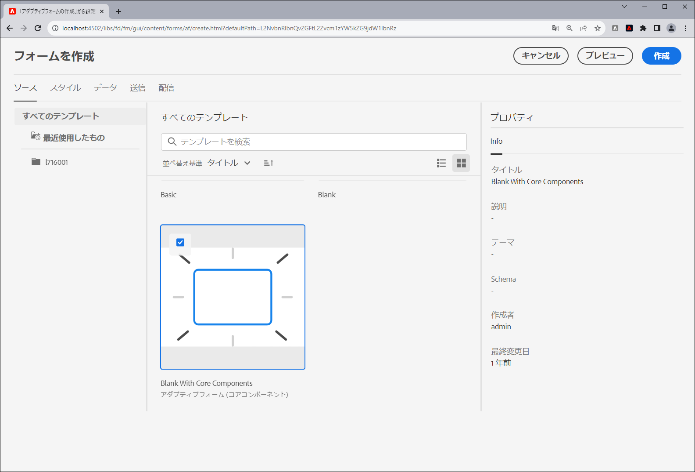

# 初めてのアダプティブフォームの作成

Adobe Experience Manager ヘッドレスアダプティブフォームを使用すると、React などのフロントエンド UI を使用してフォームアプリケーションを構築したり、状態管理、検証、他の様々なタッチポイントとの統合などの機能に Forms Web SDK を使用したりできます。

例えば、顧客登録ジャーニーのデジタル化を検討している組織 We.Org について考えてみます。開発者は、Angular を使用したフロントエンドソリューションの構築に精通しています。フォームの検証と電子サインを専用のソリューションにオフロードする際に、カスタムフロントエンドを構築しようとしています。

Adobe Experience Manager ヘッドレスアダプティブフォームにより、こうした組織は、フロントエンド言語に関する既存の専門知識を利用してフォームを自由に作成できると同時に、バックエンド機能を利用してエンタープライズクラスのフォームエクスペリエンスを作成できます。

<!-- >>[!VIDEO](https://video.tv.adobe.com/v/341011/) -->

<!--   -->

## 事前準備

* [開発環境](setup-development-environment.md)をセットアップして、ローカルマシン上でヘッドレスアダプティブフォームの作成およびテストをできるようにします。
* 次のソフトウェアが、ご使用のローカル開発マシンにインストールされている必要があります。
   * [Java Development Kit 11](https://experience.adobe.com/#/downloads/content/software-distribution/jp/general.html?1_group.propertyvalues.property=.%2Fjcr%3Acontent%2Fmetadata%2Fdc%3AsoftwareType&amp;1_group.propertyvalues.operation=equals&amp;1_group.propertyvalues.0_values=software-type%3Atooling&amp;fulltext=Oracle%7E+JDK%7E+11%7E&amp;orderby=%40jcr%3Acontent%2Fjcr%3AlastModified&amp;orderby.sort=desc&amp;layout=list&amp;p.offset=0&amp;p.limit=14)
   * [Git の最新リリース](https://git-scm.com/downloads)。Git を初めて使用する場合は、[Getting Started - Installing Git](https://git-scm.com/book/en/v2/Getting-Started-Installing-Git) を参照してください。
   * [Node.js 16.13.0 以降](https://nodejs.org/ja/download/)。Node.js を初めて使用する場合は、[How to install Node.js](https://nodejs.dev/en/learn/how-to-install-nodejs) を参照してください。
   * [Maven 3.6 以降](https://maven.apache.org/download.cgi)。Maven を初めて使用する場合は、[Installing Apache Maven](https://maven.apache.org/install.html) を参照してください。


## アーキタイププロジェクトを使用したヘッドレスアダプティブフォームの作成

アーキタイププロジェクトは、Maven ベースのテンプレートです。ヘッドレスアダプティブフォームの使用を開始するためのベストプラクティスに基づいて、最小限のプロジェクトを作成します。また、Forms as a Cloud Service およびローカル開発環境向けのヘッドレスアダプティブフォーム機能も含まれています。ベータフェーズでは、アーキタイプ 37 以降をベースとするプロジェクトを作成してデプロイする必要があります。ベータフェーズ以降は、プロジェクトはカスタマイズにのみ必要となります。

初めてのヘッドレスアダプティブフォームを作成してレンダリングするには、次の手順を実行します。

1. [AEM アーキタイプベースのプロジェクトを作成しデプロイする](#create-an-archetype-based-project)
1. [プロジェクトを AEM SDK にデプロイする](#deploy-the-project-to-a-local-development-environment)
1. [ヘッドレスアダプティブフォームの JSON スキーマを作成して AEM SDK インスタンスにアップロードする](#create-add-json-representation-of-headless-adaptive-forms)
1. [Blank With Core Components テンプレートに基づいてアダプティブフォームを作成する](#create-adaptive-form-with-blank-with-core-components-template)


### 1. AEM アーキタイプベースのプロジェクトを作成しデプロイする {#create-an-archetype-based-project}

オペレーティングシステムに応じて、次のコマンドを実行して Experience Manager Forms as a Cloud Service プロジェクトを作成します。アーキタイプバージョン 37 以降を使用します。アーキタイプの最新バージョンについては、[アーキタイプのドキュメント](https://experienceleague.adobe.com/docs/experience-manager-core-components/using/developing/archetype/overview.html?lang=ja)を参照してください。

**Microsoft Windows**

1. 管理者権限でコマンドプロンプトを開きます（コマンドプロンプトまたは bash シェルを管理者として実行します）
1. 以下のコマンドを実行します。

   ```shell
     mvn -B org.apache.maven.plugins:maven-archetype-plugin:3.2.1:generate ^
     -D archetypeGroupId=com.adobe.aem ^
     -D archetypeArtifactId=aem-project-archetype ^
     -D archetypeVersion=37 ^
     -D appTitle=myheadlessform ^
     -D appId=myheadlessform ^
     -D groupId=com.myheadlessform ^
     -D includeFormsenrollment="y" ^
     -D includeFormsheadless="y" 
   ```

   * `appTitle` を設定して、タイトルとコンポーネントグループを定義します。
   * `appId` を設定して、Maven アーティファクト ID、コンポーネントフォルダー名、設定フォルダー名、コンテンツフォルダー名およびクライアントライブラリ名を定義します。
   * `groupId` を設定して、Maven グループ ID と Java ソースパッケージを定義します。
   * `includeFormsenrollment=y` オプションを使用して、アダプティブフォームの作成に必要なフォーム固有の設定、テーマ、テンプレート、コアコンポーネントおよび依存関係を組み込みます。
   * `includeFormsheadless=y` オプションを使用して、ヘッドレスアダプティブフォーム機能の追加に必要な Forms コアコンポーネントおよび依存関係を組み込みます。このオプションを有効にすると、以下が組み込まれます。
      * [コアコンポーネント](https://experienceleague.adobe.com/docs/experience-manager-core-components/using/introduction.html?lang=ja)を含んだ **Blank With Core Components** テンプレート。
      * フロントエンド React モジュール `ui.frontend.react.forms.af`。これは、React アプリでヘッドレスアダプティブフォームをレンダリングするのに役立ちます。


**Apple macOS または Linux**

1. ターミナルをルートユーザーとして開きます。管理者権限でコマンドを実行できるようになります。ターミナルウィンドウを開いた後に `sudo root` コマンドを使用して、管理者権限でコマンドを実行することもできます。
1. 以下のコマンドを実行します。

   ```shell
     mvn -B org.apache.maven.plugins:maven-archetype-plugin:3.2.1:generate \
     -D archetypeGroupId=com.adobe.aem \
     -D archetypeArtifactId=aem-project-archetype \
     -D archetypeVersion=37 \
     -D appTitle=myheadlessform \
     -D appId=myheadlessform \
     -D groupId=com.myheadlessform \
     -D includeFormsenrollment="y" \
     -D includeFormsheadless="y"  
   ```

   * `appTitle` を設定して、タイトルとコンポーネントのグループを定義します。
   * `appId` を設定して、Maven アーティファクト ID、コンポーネントフォルダー名、設定フォルダー名、コンテンツフォルダー名およびクライアントライブラリ名を定義します。
   * `groupId` を設定して、Maven グループ ID と Java ソースパッケージを定義します。
   * `includeFormsenrollment=y` オプションを使用して、アダプティブフォームの作成に必要なフォーム固有の設定、テーマ、テンプレート、コアコンポーネントおよび依存関係を組み込みます。
   * `includeFormsheadless=y` オプションを使用して、ヘッドレスアダプティブフォーム機能の追加に必要な Forms コアコンポーネントおよび依存関係を組み込みます。このオプションを有効にすると、以下が組み込まれます。
      * [コアコンポーネント](https://experienceleague.adobe.com/docs/experience-manager-core-components/using/introduction.html?lang=ja)を含んだ **Blank With Core Components** テンプレート。
      * フロントエンド React モジュール `ui.frontend.react.forms.af`。これは、React アプリでヘッドレスアダプティブフォームをレンダリングするのに役立ちます。

コマンドが正常に完了すると、`appID` で指定した名前のプロジェクトフォルダーが作成されます。例えば、値 `myheadlessform` の `appID` を使用する場合は、`myheadlessform` という名前のフォルダーが作成されます。ここには、アーキタイプベースのプロジェクトが含まれます。


### 2. プロジェクトを AEM SDK にデプロイする {#deploy-the-project-to-a-local-development-environment}

プロジェクトを AEM SDK インスタンスにデプロイすると、ヘッドレスアダプティブフォーム機能、**Blank With Core Components** テンプレート、プロジェクトに含まれるその他のリソースが開発環境に追加されます。<!-- Deploy the project to your local development environment to locally create Headless Adaptive Forms. or deploy directly to your Forms as a Cloud Service environment. !--> AEM SDK インスタンスにデプロイするには、以下の手順に従います。

1. コマンドプロンプトを開きます。Windows を使用している場合は、管理者権限でコマンドプロンプトを開きます（コマンドプロンプトまたは [Git bash シェル](https://khushwantsehgal.wordpress.com/2022/06/29/check-if-git-bash-is-running-in-administrator-mode/)を管理者として実行します）。

1. 前の手順で作成したプロジェクトディレクトリに移動します。例：`/myheadlessform`

   

1. 次のコマンドを実行します。

   ```shell
   mvn -PautoInstallPackage clean install
   ```

   「BUILD SUCCESS」メッセージが表示されるまで待ちます。
   

   依存関係を解決してプロジェクトをデプロイするのに時間がかかる場合があります。プロジェクトのデプロイに失敗した場合は、一般的な問題とその解決方法に関する[トラブルシューティング](troubleshooting.md)の記事を参照してください。


<!-- *  To learn how to deploy code to AEM as a Cloud Service, see the video in [Deploying to AEM as a Cloud Service]https://experienceleague.adobe.com/docs/experience-manager-cloud-service/content/implementing/deploying/overview.html?lang=ja#coding-against-the-right-aem-version) article : -->


### 3. ヘッドレスアダプティブフォームの JSON スキーマを作成して AEM SDK インスタンスにアップロードする {#create-add-json-representation-of-headless-adaptive-forms}

ヘッドレスアダプティブフォームは、JSON ファイルとして表されます。[ストーリーブック](https://opensource.adobe.com/aem-forms-af-runtime/storybook/?path=/story/reference-examples--contact)からサンプルフォームを入手するか、またはアーキタイププロジェクト（`[Archetype Project]\ui.content\src\main\content\jcr_root\content\dam\myheadlessform\af_model_sample.json`）に含まれているサンプルフォームを使用できます。このドキュメントでは、ストーリーブックの [introduction](https://opensource.adobe.com/aem-forms-af-runtime/storybook/?path=/story/reference-examples--introduction) フォームを使用しています。これは、ヘッドレスアダプティブフォームの使用をすぐに開始するのに役立つ単一フィールドフォームです。<!-- The [specifications](/help/assets/Headless-Adaptive-Form-Specification.pdf) document provides detailed information about various components, rules, and constraints for Headless Adaptive Forms -->

スキーマを作成してアップロードするには：

1. 拡張子が `.json` のプレーンテキストファイルを作成します。例えば `myfirstform.json` などのファイルです。ファイルシステム上の任意の場所、または AEM アーキタイプベースのプロジェクトの中（`\<project-name>\ui.content\src\main\content\jcr_root\content\dam\myheadlessform\<formname>.json`）に、このファイルを作成できます
1. 以下の JSON コードを `.json` ファイルに追加して保存します。

   ```JSON
   {
     "adaptiveform": "0.10.0",
     "items": [
       {
         "fieldType": "text-input",
         "label": {
           "value": "Enter your Name"
         },
         "name": "textInput"
       }
     ],
     "metadata": {
       "grammar": "json-formula-1.0.0",
       "version": "1.0.0"
     }
   }
   ```

   このファイルでは、フォームに 1 つのフィールドを追加しています。

   

1. [ローカル AEM SDK インスタンス](setup-development-environment.md#setup-author-instance)にログインします
1. Adobe Experience Manager／Forms／フォームとドキュメントに移動します。作成／ファイルのアップロードをタップします。
1. 手順 2 で作成した `.json` を選択してアップロードします。これで、ヘッドレスアダプティブフォームを作成する準備が整いました。この .json ファイルを AEM アーキタイプベースのプロジェクトに `\<project-name>\ui.content\src\main\content\jcr_root\content\dam\myheadlessform\<formname>.json` として保存する場合は、`mvn -PautoInstallPackage clean install` を使用して、プロジェクトと `<formname>.json` を一緒に AEM SDK にデプロイできます。

`.json` のアップロードでエラーが発生した場合は、[AEM アーキタイププロジェクトが正常にデプロイされている](#deploy-the-project-to-a-local-development-environment)ことを確認してください。

<!-- 1. Open the [contact form](https://opensource.adobe.com/aem-forms-af-runtime/storybook/?path=/story/reference-examples--contact) and tap the [](faq.md#storybook-example) icon on bottom-right side of the Storybook page to view the source code of the headless . 

You can use [Adaptive Forms builder extension for Visual Studio Code](/help/setup-development-environment.md#microsot-visual-studio-code-extension-for-headless-adaptive-forms) to build a JSON schema of your Headless Adaptive Forms. 

You can see [Storybook](https://opensource.adobe.com/aem-forms-af-runtime/storybook/?path=/story/reference-examples--introduction) for sample JSON schemas and list of components, attributes, and properties. You can also see the [specifications document](/help/assets/Headless-Adaptive-Form-Specification.pdf) for detailed information on all the components, constraints, and methods available to define Headless Adaptive Forms.

File extension of a JSON schema of Headless Adaptive Forms is .json. For example, formname.json. Create or add the file to your AEM Archetype based project. For example, `\myheadlessform\ui.content\src\main\content\jcr_root\content\dam\myheadlessform\home-loan.json` -> 

### 3. Deploy the project to a local development environment {#deploy-the-project-to-a-local-development-environment}

You can deploy the project to local development environment. It adds Headless Adaptive Forms functionality, the **Blank with core components** template, JSON schema of form, and other resources included in the project to your development environment. <!-- Deploy the project to your local development environment to locally create Headless Adaptive Forms. or deploy directly to your Forms as a Cloud Service environment. To deploy to your local development environment, use the following command: 

    `mvn -PautoInstallPackage clean install`

If you are on Windows, run the above with Administrative privileges (Run command prompt or [bash shell as an administrator](https://khushwantsehgal.wordpress.com/2022/06/29/check-if-git-bash-is-running-in-administrator-mode/)). For the complete list of commands, see [Building and Installing](https://experienceleague.adobe.com/docs/experience-manager-core-components/using/developing/archetype/using.html?lang=ja#building-and-installing).
    
<!-- *  To learn how to deploy code to AEM as a Cloud Service, see the video in [Deploying to AEM as a Cloud Service]https://experienceleague.adobe.com/docs/experience-manager-cloud-service/content/implementing/deploying/overview.html?lang=ja#coding-against-the-right-aem-version) article : -->

### 4. Blank With Core Components テンプレートに基づいてアダプティブフォームを作成する {#create-adaptive-form-with-blank-with-core-components-template}

1. [AEM SDK インスタンス](http://localhost:4502/)にログインします。

1. Adobe Experience Manager／Forms／フォームとドキュメントに移動します。

1. 「作成」をタップして、「アダプティブフォーム」を選択します。**Blank With Core Components** テンプレートを選択し、「作成」をタップします。

   

1. 以下のプロパティフィールドの値を指定します。「タイトル」フィールドと「名前」フィールドは必須です。

   * **タイトル**：フォームの表示名を指定します。タイトルを指定すると、Experience Manager Forms ユーザーインターフェイスでフォームを特定しやすくなります。
   * **名前**：フォームの名前を指定します。指定された名前のノードがリポジトリーに作成されます。タイトルを入力し始めると、名前フィールドの値が自動的に生成されます。候補として入力された値は変更可能です。「ドキュメント名」フィールドには、英数字、ハイフン、アンダースコアのみを使用できます。無効な入力は、すべてハイフンに置き換えられます。

1. 「作成」をタップします。アダプティブフォームが作成されます。

**Blank With Core Components** テンプレートが表示されない場合は、[AEM アーキタイププロジェクトが正常にデプロイされている](#deploy-the-project-to-a-local-development-environment)ことを確認します。

### 5. JSON スキーマを使用するようにアダプティブフォームを設定する {#configure-adaptive-form-to-use-the-JSON-representation}

前の手順で作成したアダプティブフォームは内容が空です。JSON スキーマを使用するようにアダプティブフォームを設定します。

1. [AEM SDK インスタンス](http://localhost:4502/)にログインします。

1. Adobe Experience Manager／Forms／フォームとドキュメントに移動します。前の手順で作成したアダプティブフォームを選択し、「編集」をタップします。エディターにアダプティブフォームが開きます。

1. アダプティブフォームコンテナコンポーネントをタップし、「プロパティ」をタップします。サイドバーにプロパティエクスプローラーが表示されます。

1. プロパティエクスプローラーで、基本アコーディオンを展開し、前の手順でアップロードした JSON スキーマのパスを「フォームランタイムドキュメントのパス」オプションに指定します。コンテナコンポーネントには、フォームのレンディションが表示されます。

1. プロパティエクスプローラーで、送信アコーディオンを展開し、アダプティブフォームの「送信アクション」を設定します。これで、フォームを React アプリで使用する準備が整いました。

1. ローカル開発マシンでホストされているフォームをレンダリングするには：

   1. `[Archetype project]\ui.frontend.react.forms.af\.env` ファイルを開き、フォームのパスを設定します。例：/content/forms/af/contact

   1. コマンドプロンプトを開き、ui.frontend.react.forms.af プロジェクトに移動して、次のコマンドを実行します。

      `npm run start`

   1. 完了したら、ブラウザーウィンドウで localhost:3000 を開いて、レンダリングされたヘッドレスアダプティブフォームを表示します。
   1. 送信機能をテストするには、AEM Forms サーバーにログインし、「**フォームを HTML でプレビュー**」オプションを使用して、フォームをプレビューモードで開きます。

[ストーリーブック](https://opensource.adobe.com/aem-forms-af-runtime/storybook/)には、様々なヘッドレスアダプティブフォームに設定できるコンポーネントやルールのリストと、ヘッドレスアダプティブフォームの JSON スキーマの例が記載されています。また、[仕様](/help/assets/Headless-Adaptive-Form-Specification.pdf)ドキュメントを参照して、ヘッドレスアダプティブフォームに関する様々なルールやプロパティについて学ぶこともできます。
