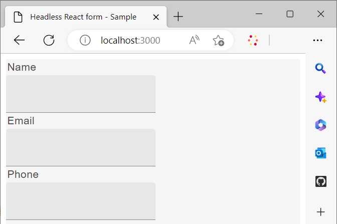

# カスタム React ライブラリを使用したヘッドレスフォームのレンダリング

<!-- This article is completely missing the image ALT tags (descriptions) for each added image asset. That is impacting the CQI score for Experience Manager in a negative way. Be sure you add the required missing image ALT tags.  -->

組織の要件やガイドラインに従って、カスタムコンポーネントを作成および実装して、ヘッドレスアダプティブフォームの外観と機能（動作）をカスタマイズできます。

これらのコンポーネントの主な目的は、フォームフィールドの外観やスタイルを制御することと、それらのフィールドを通じて収集されたデータをフォームモデルインスタンス内に格納することです。混乱を招くような場合でも、心配はいりません。これらの目的については、すぐに詳しく説明します。 ここからは、カスタムコンポーネントの作成、これらのコンポーネントを使用したフォームのレンダリング、REST エンドポイントへのデータの保存と送信を行うためのイベントの使用の初期手順に焦点を当てます。

このチュートリアルでは、Google Material UI コンポーネントを使用して、カスタム React コンポーネントを使用してヘッドレスアダプティブフォームをレンダリングする方法を示します。 ただし、このライブラリに限定されず、React コンポーネントライブラリを自由に使用したり、独自のカスタムコンポーネントを開発したりできます。

この記事を読み終えると、_スターターキットを使用してヘッドレスフォームを作成して公開する_ で作成した [ お問い合わせ ](create-and-publish-a-headless-form.md) フォームの記事は、次のように変わります。


Google マテリアル UI コンポーネントを使用してフォームをレンダリングする主な手順は、次のとおりです。


## &#x200B;1. Google マテリアル UI をインストールする

デフォルトでは、スターターキットは[アドビの Spectrum](https://spectrum.adobe.com/) コンポーネントを使用しています。これを、[Google マテリアル UI](https://mui.com/) を使用するように設定します。

1. スターターキットが実行中でないことを確認します。スターターキットを停止するには、ターミナルを開き、**react-starter-kit-aem-headless-forms** に移動して、Ctrl + C キーを押します（Windows、Mac、Linux® でも同じです）。

   ターミナルを閉じようとしないでください。ターミナルを閉じても、スターターキットは停止しません。

1. 次のコマンドを実行します。

```shell
    
    npm install @mui/material @emotion/react @emotion/styled --force
    
```

Google マテリアル UI の npm ライブラリがインストールされ、スターターキットの依存関係にライブラリが追加されます。これで、マテリアル UI コンポーネントを使用して、フォームコンポーネントをレンダリングできるようになりました。


## &#x200B;2. カスタム React コンポーネントを作成する

デフォルトの [ テキスト入力 ](https://spectrum.adobe.com/page/text-field/) コンポーネントを [Google Material UI テキストフィールド ](https://mui.com/material-ui/react-text-field/) コンポーネントに置き換えるカスタムコンポーネントを作成します。

ヘッドレスフォーム定義で使用するコンポーネントタイプ（[fieldType](https://opensource.adobe.com/aem-forms-af-runtime/storybook/?path=/story/reference-json-properties-fieldtype--text-input) または `:type`）ごとに個別のコンポーネントが必要です。 例えば、前のセクションで作成したお問い合わせフォームでは、Name、Email および Phone の各フィールドは `text-input` タイプ（[fieldType: &quot;text-input&quot;](https://opensource.adobe.com/aem-forms-af-runtime/storybook/?path=/docs/adaptive-form-components-text-input-field--def)）であり、Message フィールドは `multiline-input` タイプ（[&quot;fieldType&quot;: &quot;multiline-input&quot;](https://opensource.adobe.com/aem-forms-af-runtime/storybook/?path=/docs/reference-json-properties-fieldtype--multiline-input)）です。


[fieldType:&quot;text-input&quot;](https://opensource.adobe.com/aem-forms-af-runtime/storybook/?path=/docs/adaptive-form-components-text-input-field--def) プロパティを使用するすべてのフォームフィールドを [ マテリアル UI テキストフィールド ](https://mui.com/material-ui/react-text-field/) コンポーネントでオーバーレイするカスタムコンポーネントを作成してみましょう。


そのカスタムコンポーネントを作成し、カスタムコンポーネントを [fieldType](https://opensource.adobe.com/aem-forms-af-runtime/storybook/?path=/docs/adaptive-form-components-text-input-field--def) プロパティにマッピングするには：

1. コードエディターで **react-starter-kit-aem-headless-forms** ディレクトリを開き、`\react-starter-kit-aem-headless-forms\src\components` に移動します。


1. **`slider`** フォルダーまたは **`richtext`** フォルダーのコピーを作成し、コピーしたフォルダーの名前を **materialtextfield** に変更します。 `slider` と `richtext` は、スターターアプリで使用できる 2 つのサンプルのカスタムコンポーネントです。 これらのコンポーネントを使用して、独自のカスタムコンポーネントを作成できます。

   

1. `\react-starter-kit-aem-headless-forms\src\components\materialtextfield\index.tsx` ファイルを開き、既存のコードを以下のコードに置き換えます。このコードは、[Google マテリアル UI のテキストフィールド](https://mui.com/material-ui/react-text-field/)コンポーネントを返し、レンダリングします。

```JavaScript
 
     import React from 'react';
     import {useRuleEngine} from '@aemforms/af-react-renderer';
     import {FieldJson, State} from '@aemforms/af-core';
     import { TextField } from '@mui/material';
     import Box from '@mui/material/Box';
     import { richTextString } from '@aemforms/af-react-components';
     import Typography from '@mui/material/Typography';


     const MaterialtextField = function (props: State<FieldJson>) {

         const [state, handlers] = useRuleEngine(props);

         return(

         <Box>
             <Typography component="legend">{state.visible ? richTextString(state?.label?.value): ""} </Typography>
             <TextField variant="filled"/>
         </Box>

         )
     }

     export default MaterialtextField;
```


`state.visible` の部分では、コンポーネントが表示されるように設定されているかどうかをチェックします。そのように設定されている場合は、フィールドのラベルが `richTextString(state?.label?.value)` を使用して取得され、表示されます。


カスタムコンポーネント `materialtextfield` の準備が整いました。[fieldType: &quot;text-input&quot;](https://opensource.adobe.com/aem-forms-af-runtime/storybook/?path=/docs/adaptive-form-components-text-input-field--def) のすべてのインスタンスを Google マテリアル UI のテキストフィールドに置き換えるように、このカスタムコンポーネントを設定しましょう。

## &#x200B;3. カスタムコンポーネントをヘッドレスフォームフィールドにマッピングする

サードパーティのライブラリコンポーネントを使用してフォームフィールドをレンダリングするプロセスをマッピングと呼びます。 各（[fieldType](https://opensource.adobe.com/aem-forms-af-runtime/storybook/?path=/story/reference-json-properties-fieldtype--text-input)）を、サードパーティライブラリの対応するコンポーネントにマッピングします。

マッピング関連情報はすべて `mappings.ts` ファイルに追加されます。`...mappings` ファイル内の `mappings.ts` ステートメントは、デフォルトのマッピングを参照し、（[fieldType](https://opensource.adobe.com/aem-forms-af-runtime/storybook/?path=/story/reference-json-properties-fieldtype--text-input) または `:type`）を [Adobe Spectrum](https://spectrum.adobe.com/page/text-field/) コンポーネントでオーバーレイします。

最後の手順で作成した `materialtextfield` コンポーネントのマッピングを追加するには：

1. `mappings.ts` ファイルを開きます。

1. 次の import ステートメントを追加して、`materialtextfield` コンポーネントを `mappings.ts` ファイルに含めます。


   ```JavaScript
       import MaterialtextField from "../components/materialtextfield";
   ```

1. 次のステートメントを追加して、`text-input` を materialtextfield コンポーネントにマッピングします。


   ```JavaScript
       "text-input": MaterialtextField
   ```

   このファイルの最終コードは次のようになります。

   ```JavaScript
         import { mappings } from "@aemforms/af-react-components";
         import MaterialtextField from "../components/materialtextfield";
   
   
         const customMappings: any = {
           ...mappings,
           "text-input": MaterialtextField
        };
        export default customMappings;
   ```

1. アプリを保存して実行します。フォームの最初の 3 つのフィールドは、[Google マテリアル UI のテキストフィールド](https://mui.com/material-ui/react-text-field/) を使用してレンダリングされます。

   


   同様に、メッセージ（「fieldType」:「multiline-input」）のカスタムコンポーネントを作成し、サービス（「fieldType」:「number-input」）フィールドを評価できます。 メッセージのカスタムコンポーネントについて次の Git リポジトリを複製し、サービスフィールドを評価できます。

   [https://github.com/singhkh/react-starter-kit-aem-headless-forms](https://github.com/singhkh/react-starter-kit-aem-headless-forms)

## 次の手順

Google マテリアル UI を使用したカスタムコンポーネントでフォームをレンダリングすることに成功しました。「送信」ボタン（対応するGoogle Material UI コンポーネントにマッピング済み）をクリックしてフォームを送信したことがありますか？ まだであれば、まず試してみてください。

フォームはデータを任意のデータソースに送信しますか？ そうでなくても、ご心配なく。これは、ランタイムライブラリと通信するようにフォームが設定されていないためです。

ランタイムライブラリと通信できるようにフォームを設定するには、どうすればよいでしょうか？ すべてを詳細に説明する記事が近日公開予定です。 どうぞお楽しみに。
